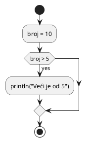

# Prevođenje Kotlin koda u UML dijagram aktivnosti

Ovaj projekat implementira alat koji vrši leksičku, sintaksnu i semantičku analizu Kotlin koda i generiše UML dijagram aktivnosti na osnovu validnog izvornog koda koristeći PlantUML.

## Struktura projekta


```
projekat/
├── examples/                # Kotlin .kt fajlovi za testiranje
├── output/                  # Generisani .puml i .png fajlovi
├── grammar/                # .g4 fajlovi za leksički i sintaksni analizator (KotlinLexer.g4, KotlinParser.g4)
├── antlr_gen/              # Generisani ANTLR fajlovi (KotlinLexer.py, KotlinParser.py, itd.)
├── semantic_analyzer.py    # Semantički analizator (nedefinisane promenljive + provera tipova)
├── diagram_generator.py    # Listener koji pretvara AST u PlantUML kod
├── uml_generator.py        # Python funkcija za pozivanje PlantUML-a i generisanje slike
├── main.py                 # Glavna skripta koja pokreće obradu i povezuje sve komponente
└──

---

##  Funkcionalnosti

### 1. Leksički i sintaksni analizator
- Implementirani pomoću ANTLR (KotlinLexer.g4 i KotlinParser.g4)

### 2. Semantička analiza
- Detekcija nedefinisanih promenljivih
- Detekcija redeklaracija
- Provera tipova u binarnim izrazima (npr. `Int + String`)

### 3. Generisanje UML dijagrama
- Prevedeni izrazi, petlje, grane, bacanja izuzetaka itd. u PlantUML kod
- Generisanje .png dijagrama pomoću PlantUML

---

## ▶️ Pokretanje projekta

### 1. Potrebni alati:
- Python 3
- Java (dostupna u PATH)
- [plantuml.jar](https://plantuml.com/download)
- ANTLR 4 (već generisani parser fajlovi se koriste)

### 2. Pokreni:
```bash
python main.py test1.kt test2.kt
```

### 3. Primer izlaza:
```bash
Generating diagram for testtypeerr.kt...
[SEMANTIČKA GREŠKA] Operator '+' nije dozvoljen za tipove Int i String
Preskakanje generisanja za testtypeerr.kt zbog semantičkih grešaka.
```

Za ispravan kod:
```bash
Generating diagram for valid.kt...
Diagram generated and saved: output/valid.png
```

---

## Primer ulaza: valid.kt
```kotlin
fun obrada() {
    val broj = 10
    if (broj > 5) {
        println("Veći je od 5")
    }
}
```

## Generisani PlantUML (valid.puml)


---

##  Napomena
Ako se u kodu detektuju semantičke greške, generisanje UML dijagrama se automatski preskače.

---